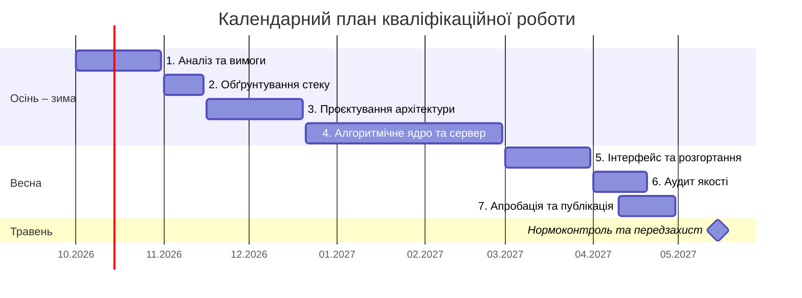

# Календарний план

> Структура реплікує «Лист завдання». Етапи синхронізовані із 7 завданнями
> наукового апарату ([[0_intro]]): етапи 1–4 завершуються до лютого 2027,
> етапи 5–7 — до кінця квітня 2027. Терміни погоджуються з керівником після
> затвердження «Листа завдання». Протокол планування — [[17-AI Insights]],
> Запис 4.

| № з/п | Назва етапу кваліфікаційної роботи | Термін виконання | Статус |
|---|---|---|---|
| 1 | Аналіз предметної області та програмних аналогів, формування вимог | Жовтень 2026 | In Progress |
| 2 | Обґрунтування архітектурного підходу та технологічного стеку | Листопад 2026 | To Do |
| 3 | Проєктування архітектури (C4, UML) та моделі даних | Листопад – Грудень 2026 | To Do |
| 4 | Розробка алгоритмічного ядра та серверної частини системи | Грудень 2026 – Лютий 2027 | To Do |
| 5 | Розробка інтерфейсу мобільного застосунку та налаштування розгортання | Березень 2027 | To Do |
| 6 | Інструментальний аудит якості програмного забезпечення | Квітень 2027 | To Do |
| 7 | Апробація системи та підготовка наукової публікації | Квітень 2027 | To Do |

Травень 2027 — нормоконтроль пояснювальної записки та передзахист.

## Пов'язано

- [[15-Паспорт проєкту]]
- [[00-Project Charter]]